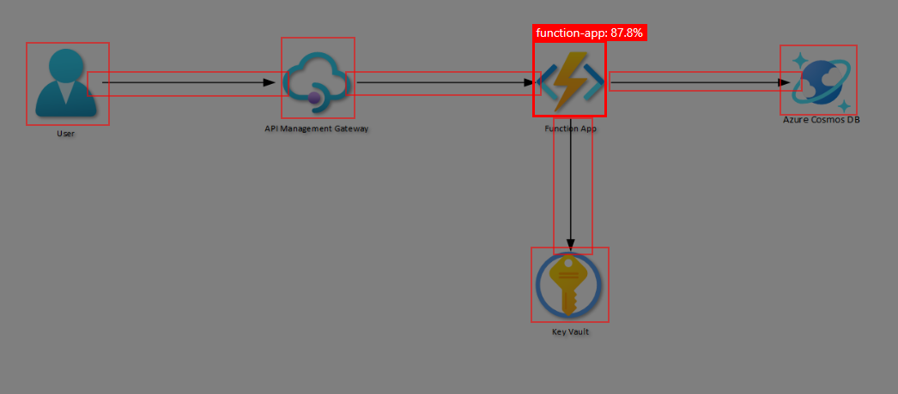

## Azure Architecture AI Toolkit
The Azure Architecture AI toolkit is a helper library, written in TypeScript, that uses Azure Custom Vision, and Azure OpenAI services to help with Azure architecture-related functionality.

## Installation
```bash
npm install azure-architecture-ai-toolkit
```

Once the toolkit is installed create a new environment file called `.env` and add the following:

```bash
OPEN_AI_API_KEY=<openai-api-key>
OPEN_AI_INSTANCE=<openai-instance-name>
OPEN_AI_API_VERSION=<openai-api-version>
OPEN_AI_DEPLOYMENT=<openai-deployment-name>
CUSTOM_VISION_PREDICTION_KEY=<custom-vision-prediction-api-key>
CUSTOM_VISION_PREDICTION_INSTANCE=<custom-vision-prediction-instance-name>
CUSTOM_VISION_PROJECT_ID=<custom-vision-project-id>
CUSTOM_VISION_PUBLISH_ITERATION_NAME=<custom-vision-model-iteration-name>
```

In your code, you can then initialise the toolkit as follows:

```typescript
import dotenv from "dotenv";
import * as toolkit from "azure-architecture-ai-toolkit";

// Configure dotenv
dotenv.config();

// Initialise the toolkit
toolkit.initialise({
	openAIApiKey: process.env.OPEN_AI_API_KEY!,
	openAIInstance: process.env.OPEN_AI_INSTANCE!,
	openAIApiVersion: process.env.OPEN_AI_API_VERSION!,
	openAIDeployment: process.env.OPEN_AI_DEPLOYMENT!,
	customVisionPredictionKey: process.env.CUSTOM_VISION_PREDICTION_KEY!,
	customVisionPredictionInstance: process.env.CUSTOM_VISION_PREDICTION_INSTANCE!,
	customVisionPublishIterationName: process.env.CUSTOM_VISION_PUBLISH_ITERATION_NAME!,
	customVisionProjectId: process.env.CUSTOM_VISION_PROJECT_ID!,
	customVisionDetectionThreshold: 35,
	customVisionOverlapThreshold: 3
});
```

Currently, the library supports the following functionality:

## 1. Azure Architecture Diagram Service Detection
This functionality allows you to detect the Azure services used in an architecture diagram. To use this functionality, you need to have an Azure Cognitive Services Custom Vision API key, and a deployed model that has been trained to detect Azure service icons and connectors.



### 1.1. Detect Azure Services in an Architecture Diagram
```typescript
export const detectServicesFromDiagram = async (pathToFile: string) => {
    const result = await toolkit.detectServicesFromDiagram(pathToFile);
    console.log(result);
}
```
This function takes in a path to a file, and returns a JSON array of Azure services detected in the diagram and connectors between them.

## 2. Azure Architecture Explanation
This functionality allows you to generate a plain English explanation for an architecture diagram. This function internally uses the detection functionality above, and then uses Azure OpenAI to generate an explanation of the diagram. To use this functionality, you need to have an OpenAI API key.

### 2.1. Generate an Explanation from an Architecture Diagram

This function takes in a path to a file, either local or remotely hosted, and returns a plain English explanation of the diagram.

```typescript
export const explainDiagram = async (pathToFile: string) => {
    const result = await toolkit.explainDiagram(pathToFile);
    console.log(result);
}
```

This would output something like the following:


> The architecture diagram consists of several Azure services connected to each other using connectors. 
> 
> 1. The diagram includes an API management service, which is connected to a connector on the right and another connector on the left. The data flows from the API management service to both connectors.
> 
> 2. There is also a function app service, which is connected to a connector on the left, a connector below, and a connector on the right. The data flows from the function app service to the left and right connectors, and also downward to the connector below.
> 
> 3. A key vault service is connected to a connector above. The data flows from the key vault service to the connector above.
> 
> 4. A Cosmos DB service is connected to a connector on the left. The data flows from the Cosmos DB service to the connector on the left.
> 
> 5. There are two arrow connectors - a right arrow and a down arrow. The right arrow connects the API management service to the function app service on the left and to the user entity on the right. The down arrow connects the function app service to the user entity above and to the key vault service below.
> 
> 6. The user entity is connected to a connector on the right. The data flows from the user entity to the connector on the right.
> 
> In summary, the architecture diagram shows the flow of data between various Azure services using connectors, with the API management service and function app service being central to the data flow.

## 3. Azure Architecture Infrastructure-as-Code Generation
This functionality allows you to generate either a Terraform or Bicep code template from the specified architecture diagram. This function internally uses the detection functionality above, and then uses Azure OpenAI to generate IaC for the services the diagram. To use this functionality, you need to have an OpenAI API key.

### 3.1. Generate Terraform IaC from an Architecture Diagram

This function takes in a path to a file, either local or remotely hosted, and returns a Terraform template for the services detected within the architecture diagram.

```typescript
export const generateCodeFromDiagram = async (pathToFile: string) => {
    const result = await toolkit.generateCodeFromDiagram(pathToFile, toolkit.IaCLanguage.Terraform);
    console.log(result);
}
```

### 3.2. Generate Bicep IaC from an Architecture Diagram

This function takes in a path to a file, either local or remotely hosted, and returns a Bicep template for the services detected within the architecture diagram.

```typescript
export const generateCodeFromDiagram = async (pathToFile: string) => {
    const result = await toolkit.generateCodeFromDiagram(pathToFile, toolkit.IaCLanguage.Bicep);
    console.log(result);
}
```